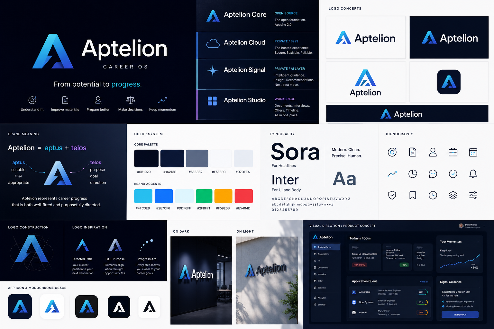
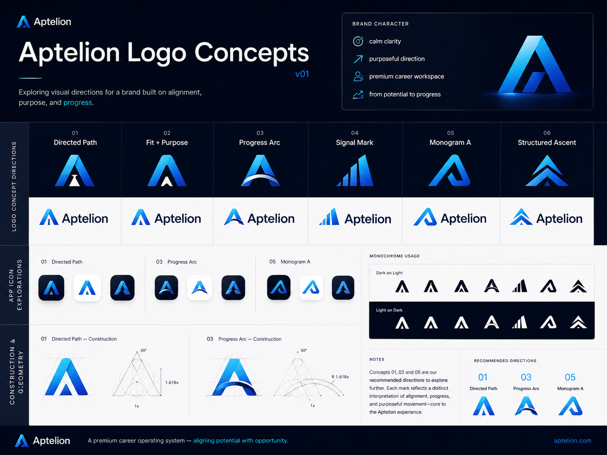
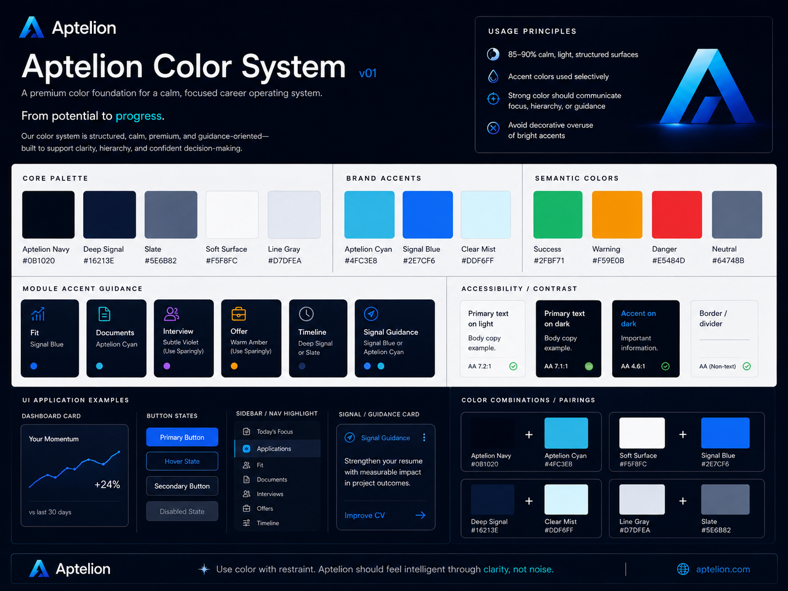

# Aptelion Brand Guidelines

## 1. Brand Direction

Aptelion is a career operating system for focused professional growth.

It is not just a job application tracker. Aptelion helps people evaluate opportunities, improve their materials, prepare with structure, and move every application forward with clarity and intent.

Core promise:

> From potential to progress.

Primary positioning:

> Aptelion turns career uncertainty into a clear next move.

Hero direction:

> Build your next move with intent.

Emotional undertone:

> Calm clarity for important career decisions.

Aptelion should feel like a premium career workspace: structured, intelligent, calm, and useful. It should help users understand what matters now, what is missing, and what the next best move should be.

## 2. Brand Meaning

The name Aptelion is built around two ideas:

- **aptus**: suitable, fitted, appropriate
- **telos**: purpose, goal, direction

Together, Aptelion represents career progress that is both well-fitted and purposefully directed.

The product should help users answer:

- Which opportunity fits me?
- What should I improve before applying?
- How should I prepare?
- What needs attention today?
- What is the clearest next step?

## 3. Brand Architecture

Use the following brand architecture:

- **Aptelion**: the main product and platform brand.
- **Aptelion Core**: the open-source foundation.
- **Aptelion Cloud**: the hosted commercial SaaS product.
- **Aptelion Vadis**: the private AI guidance and decision-support layer.
- **Aptelion Studio**: the workspace experience for documents, applications, interviews, and offers.

### 3.1 Aptelion Core

Aptelion Core is the open-source foundation of the product.

License:

> Apache License 2.0

Aptelion Core may include:

- core application structure
- reusable UI components
- basic application tracking
- basic career workspace primitives
- basic document workspace structure
- local-first or self-hostable foundations
- public data models
- public API contracts
- extension points
- design tokens
- shared frontend architecture

Aptelion Core should be useful on its own, but it should not contain the proprietary business logic that powers the commercial SaaS product.

### 3.2 Aptelion Cloud

Aptelion Cloud is the hosted commercial SaaS version of Aptelion.

Aptelion Cloud may include:

- managed hosting
- authentication and user accounts
- workspace synchronization
- team and organization features
- billing and subscription handling
- managed storage
- premium integrations
- commercial analytics
- advanced workflow automation
- production-grade operational infrastructure

Aptelion Cloud is private and proprietary.

### 3.3 Aptelion Vadis

Aptelion Vadis is the private AI guidance layer that helps users understand fit, identify gaps, prepare with focus, and choose their clearest next move.

Vadis should not be presented as a generic chatbot. It should feel like a precise, calm decision-support layer inside Aptelion.

Use **Vadis** when referring to intelligent recommendations, fit analysis, contextual guidance, and next-step suggestions.

Examples:

- "Vadis found 3 gaps in this application."
- "Vadis recommends improving your CV before applying."
- "Vadis prepared a focused interview path for this role."
- "Vadis identified a missing keyword pattern in this job description."
- "Vadis suggests following up on this application today."
- "Vadis shows why this role may be a strong fit."

Aptelion Vadis may include:

- fit scoring
- role-to-profile analysis
- CV and job description comparison
- interview preparation logic
- document improvement suggestions
- offer comparison support
- next-best-action recommendations
- proprietary prompts and evaluation logic
- ranking and prioritization models
- career progress insights

Aptelion Vadis is private and proprietary.

### 3.4 Aptelion Studio

Aptelion Studio is the workspace layer where users actively work on their career materials and decisions.

Aptelion Studio may include:

- Document Studio
- Interview Studio
- Application workspace
- Offer workspace
- Timeline workspace

Recommended split:

- **Studio Essentials**: basic open-source workspace capabilities inside Aptelion Core.
- **Studio Pro**: advanced commercial functionality inside Aptelion Cloud.

Studio Essentials may include:

- basic CV sections
- basic document structure
- simple application notes
- manual status tracking
- reusable layout components

Studio Pro may include:

- AI-guided document rewriting
- block-level document improvement
- tailored CV generation
- tailored cover letters
- interview simulations
- follow-up generation
- offer comparison
- advanced timeline automation
- career decision support

## 4. Open-Core Product Strategy

Aptelion follows an open-core model.

The open-source core should be credible, useful, and technically well-built. It should demonstrate product quality and allow developers to understand, self-host, extend, and trust the foundation.

The commercial product should provide advanced value through hosted infrastructure, intelligent guidance, premium workflows, and proprietary business logic.

### Keep open source

- shared UI foundation
- design system primitives
- basic application tracker
- basic document workspace
- basic timeline primitives
- public schemas
- public extension interfaces
- reusable frontend components
- documentation
- local development setup

### Keep private

- AI scoring logic
- recommendation engine
- proprietary prompts
- document generation logic
- advanced fit analysis
- advanced interview preparation
- offer comparison logic
- multi-tenant SaaS infrastructure
- billing
- premium integrations
- commercial analytics
- production deployment configuration
- internal evaluation datasets
- advanced automation logic

## 5. Personality

Aptelion should feel:

- premium
- calm
- intelligent
- focused
- supportive
- precise
- structured
- quietly confident
- useful before decorative

Aptelion should not feel:

- loud
- gimmicky
- militaristic
- gamer-like
- overhyped
- generic HR software
- crypto-like
- aggressively futuristic
- filled with empty AI marketing language

## 6. Visual System

The product should feel like a premium career command center, but not a military dashboard.

Preferred visual qualities:

- clean surfaces
- generous spacing
- soft depth
- calm contrast
- selective accent color
- subtle motion
- structured information hierarchy
- focused cards and workspaces
- clear action hierarchy
- minimal but meaningful visual signals

Avoid:

- excessive glow
- excessive violet as the main brand color
- too many gradients
- aggressive tactical language
- too many uppercase labels
- noisy animated backgrounds
- decorative UI without product meaning
- cyberpunk styling
- generic AI orb visuals

### Visual references

These concept images are the current base visual direction for Aptelion. Use them as reference material for UI mood, logo direction, color balance, and brand consistency.

## 7. Color System

Core palette:

- Aptelion Navy: `#0B1020`
- Deep Vadis: `#16213E`
- Slate: `#5E6B82`
- Soft Surface: `#F5F8FC`
- Line Gray: `#D7DFEA`

Brand accents:

- Aptelion Cyan: `#4FC3E8`
- Vadis Blue: `#2E7CF6`
- Clear Mist: `#DDF6FF`

Semantic colors:

- Success: `#2FBF71`
- Warning: `#F59E0B`
- Danger: `#E5484D`
- Neutral: `#64748B`

### Usage principle

85–90% of the UI should remain calm, light, structured, and premium.

Accent colors should be used selectively for:

- primary actions
- active navigation
- guidance states
- focus states
- Vadis recommendations
- important product feedback
- meaningful progress indicators

Do not use accent colors as decoration. Every strong color should communicate state, focus, hierarchy, or guidance.

### Module accent guidance

Use brand colors consistently across modules:

- Fit: Vadis Blue
- Documents: Aptelion Cyan
- Interview: subtle violet may be used sparingly
- Offer: warm amber may be used sparingly
- Timeline: Deep Vadis or Slate
- Vadis guidance: Vadis Blue or Aptelion Cyan

Violet should not become the main brand color. It may appear only as a subtle secondary accent, especially in Interview-related surfaces.

## 8. Typography

Preferred typography:

- Headlines: **Sora**
- UI and body text: **Inter**

Typography should feel:

- modern
- clean
- premium
- readable
- precise

Use a consistent type hierarchy across the product.

Recommended usage:

- Page titles: Sora, semibold
- Section headings: Sora or Inter, semibold
- Body text: Inter, regular
- UI labels: Inter, medium
- Metadata: Inter, regular or medium
- Buttons: Inter, medium
- Data values: Inter, medium or semibold

Avoid:

- mixing too many font families
- decorative serif fonts
- excessive uppercase text
- overly small metadata
- heavy font weights everywhere
- inconsistent heading sizes

## 9. Product Language

Use calm, useful, career-focused language.

Prefer:

- Fit Overview
- Analyze fit
- Documents
- Document Studio
- Interview Studio
- Offer
- Timeline
- Guidance
- Vadis Guidance
- Next best move
- Momentum
- Application Queue
- Career workspace
- Tailored document
- Follow-up due
- Keyword gap found
- Improve this section
- Preview impact
- Decision clarity
- Progress signal
- Recommended next action

Avoid:

- Tactical
- Combat
- Weaponized career language
- Practice-room labels that feel gamer-like
- Weaponry
- Mission Intel
- Deploy
- Operative
- Elite network
- Secure link enabled
- Intelligence AX-92
- Kwd Deficiency Detected
- Initiate
- Synchronizing Intel
- Hands-off automation promises
- Magic-style AI language
- Supercharged career hacking

## 10. Main Product Areas

Use the following workspace structure:

### 10.1 Fit

Purpose:

Help users understand whether an opportunity is worth pursuing and what needs improvement.

Includes:

- role fit
- match score
- strengths
- gaps
- missing keywords
- experience alignment
- recommended next action

Preferred labels:

- Fit Overview
- Match Score
- Strengths
- Gaps
- Improve Fit
- Analyze Fit
- Recommended Next Action

### 10.2 Documents

Purpose:

Help users create, improve, and tailor career materials.

Includes:

- CV
- cover letter
- tailored versions
- block-level editing
- reusable content blocks
- future direction: no-code document studio

Preferred labels:

- Documents
- Document Studio
- Tailored CV
- Cover Letter
- Improve this section
- Preview impact
- Version history

### 10.3 Interview

Purpose:

Help users prepare for interviews with structure and confidence.

Includes:

- guided interview preparation
- scenario selection
- answer practice
- follow-up questions
- session recap
- weak answer detection
- targeted improvement suggestions

Preferred labels:

- Interview Studio
- Practice path
- Answer review
- Follow-up question
- Session recap
- Improve answer

### 10.4 Offer

Purpose:

Help users evaluate compensation, trade-offs, and decision clarity.

Includes:

- compensation
- negotiation
- offer comparison
- decision clarity
- risk and upside analysis

Preferred labels:

- Offer
- Offer Overview
- Compare offers
- Decision clarity
- Negotiation notes
- Compensation breakdown

### 10.5 Timeline

Purpose:

Help users keep applications moving and avoid losing momentum.

Includes:

- milestones
- deadlines
- follow-ups
- reminders
- application history
- next actions

Preferred labels:

- Timeline
- Follow-up due
- Milestone
- Next action
- Application history
- Momentum

## 11. Dashboard Principles

The dashboard should answer:

- What matters now?
- What is stuck?
- What is the next best move?
- Where am I losing momentum?
- Which application needs attention today?

Preferred dashboard sections:

- Today’s Focus
- Momentum
- Application Queue
- Vadis Guidance
- Recent Work
- Follow-ups
- At Risk
- Ready to Improve

Avoid dashboards that only display passive statistics.

The dashboard should not be a generic analytics page. It should be an action-oriented career workspace.

## 12. Motion

Motion should be subtle and intentional.

Use:

- soft fade
- short slide
- subtle rise
- calm focus aura
- small hover lift
- smooth tab transitions
- progress transitions
- gentle card reveal

Avoid:

- flashy shine effects
- aggressive scanning lines
- constant pulsing
- excessive animated grids
- distracting background motion
- crypto-style glow effects
- AI orb animations without product meaning

## 13. Logo Direction

The Aptelion logo should be abstract, precise, and meaningful.

Preferred concepts:

### Directed Path

A minimal abstract "A" built from two directional paths. One side represents the user's current position; the other represents progress toward a clear goal.

### Fit + Purpose

Two geometric forms that align into a stable mark. This reflects the idea of fit, suitability, and career alignment.

### Progress Arc

A subtle arc moving through several points, representing applications, documents, interviews, offers, and decisions.

Avoid:

- generic stars
- generic compass icons
- literal horizons
- rocket icons
- chat bubbles
- AI sparkles
- brain icons
- overly complex symbols
- aggressive arrows

The logo should work well as:

- app icon
- favicon
- GitHub organization mark
- landing page logo
- dashboard sidebar mark
- monochrome mark
- small-size UI icon

## 14. UI Implementation Notes

When updating the UI:

- Keep the existing Angular architecture.
- Keep Spartan UI where it makes sense.
- Prefer reusable components and design tokens over repeated long Tailwind class strings.
- Keep copy consistent with the Aptelion brand direction.
- Do not introduce large new dependencies unless clearly justified.
- Preserve functionality while improving brand consistency.
- Keep component naming clear and domain-oriented.
- Avoid building decorative UI that does not support product meaning.
- Prefer calm, structured, high-clarity interfaces.
- Build reusable layout primitives for dashboard cards, workspace sections, status surfaces, and guidance panels.

## 15. Naming Rules

Use the following naming consistently:

Correct:

- Aptelion
- Aptelion Core
- Aptelion Cloud
- Aptelion Vadis
- Aptelion Studio
- Vadis Guidance
- Document Studio
- Interview Studio
- Fit Overview
- Application Queue

Avoid:

- Horizon
- Legacy guidance-layer names
- Generic chatbot labels
- Magic-style AI labels
- Tactical language labels
- Weaponized career labels
- Weaponized career framing

Do not overuse the word AI in the interface. The product should feel intelligent through its behavior, not through repeated AI labeling.

## 16. Voice and Tone

Aptelion speaks with calm precision.

The tone should be:

- clear
- direct
- supportive
- specific
- professional
- quietly confident

Good examples:

- "This role is a strong fit, but your CV does not yet show enough evidence for the backend requirements."
- "Improve your project section before applying."
- "This application is waiting on a follow-up."
- "Your interview preparation should focus on system design and ownership examples."
- "This offer is stronger on compensation, but weaker on growth potential."

Bad examples:

- "Let’s crush this application."
- "Your career tools are ready for battle."
- "AI has detected a tactical weakness."
- "Deploy your elite CV."
- "The product will handle your career for you."
- "A magic assistant will supercharge your future."

## 17. Product Experience Principles

Aptelion should help users make progress without creating noise.

Every major screen should support at least one of these outcomes:

- understand fit
- improve material
- prepare better
- compare clearly
- follow up on time
- decide with confidence
- maintain momentum

The product should reduce career uncertainty, not add another dashboard to manage.

## 18. Final Brand Summary

Aptelion is a premium career operating system for focused professional growth.

It helps users move from potential to progress by combining structured workspaces, clear application tracking, document improvement, interview preparation, offer clarity, and intelligent guidance.

Aptelion Core provides the open foundation.

Aptelion Cloud provides the managed commercial SaaS experience.

Aptelion Vadis provides private, intelligent decision support.

Aptelion Studio provides the focused workspace where career progress happens.
